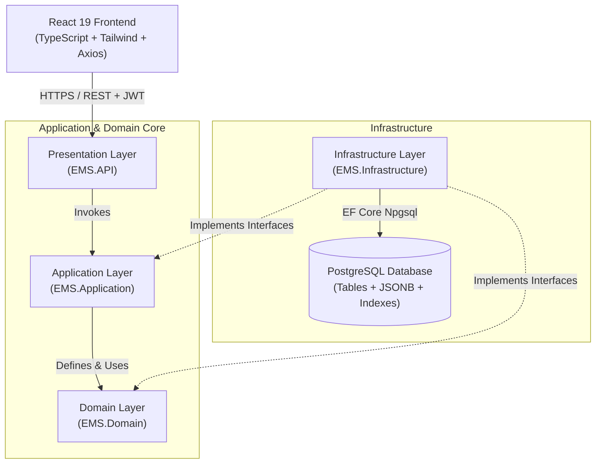
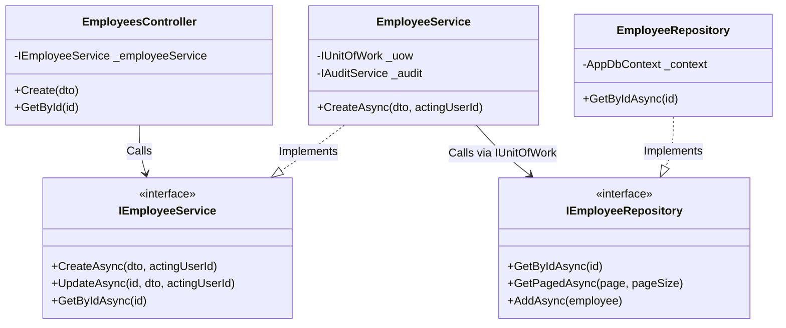
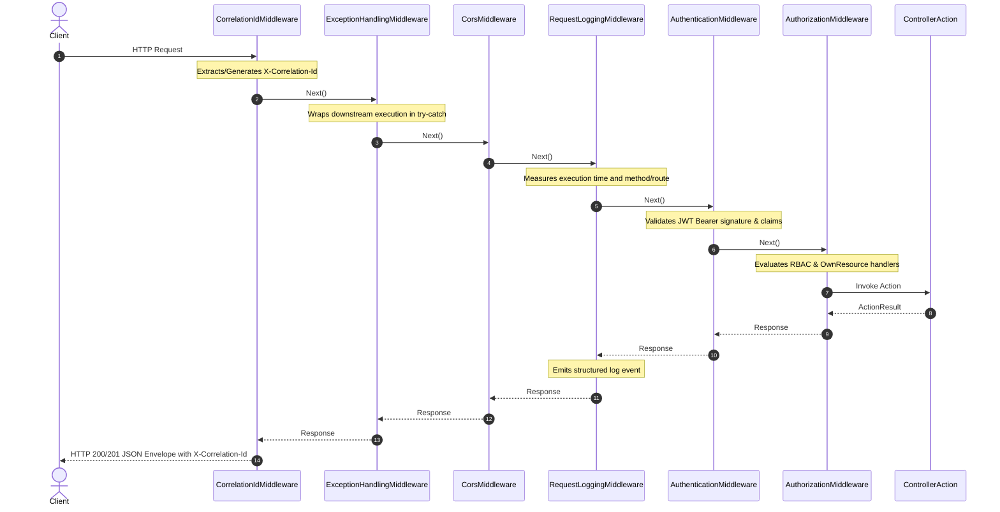

# EMS Architecture & System Design

## 1. High-Level Architecture

The Employee Management System follows **Clean Architecture** (Ports and Adapters / Layered Architecture) where the business logic does not depend on database implementations, web frameworks, or third-party libraries.

---

## 2. Low-Level Layer Responsibilities & Dependency Inversion

### Dependency Rules:
1. `EMS.Domain`: Zero dependencies on any other layer or third-party ORMs.
2. `EMS.Application`: References only `EMS.Domain`. Contains business use-cases, validators, exceptions, and DTO contracts.
3. `EMS.Infrastructure`: References `EMS.Domain` and `EMS.Application`. Implements EF Core `AppDbContext`, repository interfaces, JWT generators, and password hashers.
4. `EMS.API`: References `EMS.Application` and `EMS.Infrastructure` (solely for Dependency Injection registration in `Program.cs`).

---

## 3. Middleware Execution Pipeline Order (§6.4)

The pipeline is registered in strict execution order to guarantee error handling, tracing, and security:

