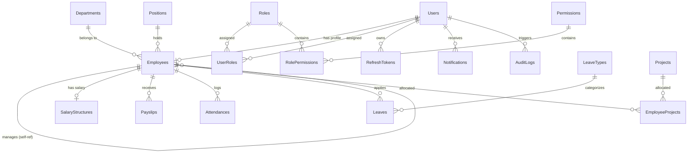

# EMS Database Design & Relational Schema

## 1. Entity Relationship (ER) Diagram

---

## 2. Table Specifications, Indexes & Constraints

### 2.1 Core Relational Tables

| Table | Columns & Types | Constraints & Indexes |
| :--- | :--- | :--- |
| `Users` | `Id (int PK)`, `Email (varchar(150))`, `PasswordHash (text)`, `PasswordSalt (text)`, `IsLocked (bool)`, `FailedLoginCount (int)`, `LastLoginAt (timestamp)`, `CreatedAt (timestamp)` | `UNIQUE(Email)` |
| `Roles` | `Id (int PK)`, `Name (varchar(100))`, `Description (text)` | `UNIQUE(Name)` |
| `Permissions` | `Id (int PK)`, `Code (varchar(100))`, `Description (text)` | `UNIQUE(Code)` |
| `UserRoles` | `UserId (FK)`, `RoleId (FK)` | `PK(UserId, RoleId)`, `ON DELETE CASCADE` |
| `RolePermissions` | `RoleId (FK)`, `PermissionId (FK)` | `PK(RoleId, PermissionId)`, `ON DELETE CASCADE` |
| `RefreshTokens` | `Id (int PK)`, `UserId (FK)`, `TokenHash (text)`, `ExpiresAt (timestamp)`, `CreatedAt (timestamp)`, `RevokedAt (timestamp)`, `ReplacedByTokenHash (text)` | `INDEX(TokenHash)`, `ON DELETE CASCADE` |
| `Departments` | `Id (int PK)`, `Name (varchar(100))`, `ManagerId (FK, nullable)`, `Location (varchar(150))` | `UNIQUE(Name)`, `ON DELETE SET NULL` |
| `Positions` | `Id (int PK)`, `Title (varchar(100))`, `Description (text)` | `UNIQUE(Title)` |
| `Employees` | `Id (int PK)`, `EmployeeCode (varchar(20))`, `FirstName (varchar(100))`, `LastName (varchar(100))`, `Email (varchar(150))`, `Phone (varchar(20))`, `DateOfBirth (date)`, `Gender (varchar(10))`, `DepartmentId (FK)`, `PositionId (FK)`, `ManagerId (FK, nullable)`, `JoiningDate (date)`, `EmploymentType (int)`, `Status (int)`, `UserId (FK)`, `CreatedAt (timestamp)`, `UpdatedAt (timestamp)` | `UNIQUE(Email)`, `UNIQUE(EmployeeCode)`, `INDEX(DepartmentId)`, `INDEX(ManagerId)`, `ON DELETE RESTRICT` |
| `Attendances` | `Id (int PK)`, `EmployeeId (FK)`, `Date (date)`, `CheckInTime (timestamp)`, `CheckOutTime (timestamp)`, `Status (int)` | `UNIQUE(EmployeeId, Date)`, `INDEX(Date)` |
| `Leaves` | `Id (int PK)`, `EmployeeId (FK)`, `LeaveTypeId (FK)`, `StartDate (date)`, `EndDate (date)`, `Reason (text)`, `Status (int)`, `ApprovedBy (FK, nullable)`, `ApprovedAt (timestamp)` | `INDEX(EmployeeId)`, `INDEX(Status)` |
| `SalaryStructures` | `Id (int PK)`, `EmployeeId (FK, unique)`, `BasicSalary (numeric)`, `HRA (numeric)`, `OtherAllowances (numeric)`, `PFDeduction (numeric)`, `EffectiveFrom (timestamp)` | `UNIQUE(EmployeeId)` |
| `Payslips` | `Id (int PK)`, `EmployeeId (FK)`, `Month (int)`, `Year (int)`, `GrossSalary (numeric)`, `Deductions (numeric)`, `NetSalary (numeric)`, `GeneratedAt (timestamp)` | `UNIQUE(EmployeeId, Month, Year)` |
| `Projects` | `Id (int PK)`, `Name (varchar(150))`, `Description (text)`, `StartDate (timestamp)`, `EndDate (timestamp)`, `Status (varchar(50))`, `ManagerId (FK, nullable)` | `INDEX(ManagerId)` |
| `EmployeeProjects` | `EmployeeId (FK)`, `ProjectId (FK)`, `AllocatedFrom (timestamp)`, `AllocatedTo (timestamp)` | `PK(EmployeeId, ProjectId)`, `ON DELETE CASCADE` |
| `AuditLogs` | `Id (int PK)`, `UserId (FK, nullable)`, `Action (varchar(100))`, `EntityName (varchar(100))`, `EntityId (varchar(100))`, `OldValue (jsonb, nullable)`, `NewValue (jsonb, nullable)`, `IpAddress (text)`, `CorrelationId (text)`, `Timestamp (timestamp)` | `INDEX(UserId)`, `INDEX(Timestamp)`, `INDEX(CorrelationId)` |
| `Notifications` | `Id (int PK)`, `UserId (FK)`, `Type (varchar(50))`, `Title (varchar(200))`, `Message (text)`, `IsRead (bool)`, `CreatedAt (timestamp)` | `INDEX(UserId)` |
