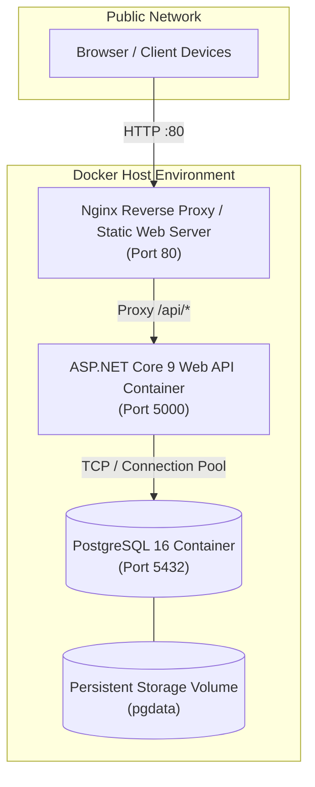

# EMS Deployment & DevOps Guide

## 1. Deployment Architecture



---

## 2. Docker Compose Deployment

The application includes a production-ready `docker-compose.yml` to spin up the database, backend, and frontend with a single command:

```bash
docker-compose up --build -d
```

### Services Included:
- **`postgres`**: PostgreSQL 16 Alpine database with health checks and persistent volume storage.
- **`ems-api`**: ASP.NET Core 9 Web API listening on port `5000`.
- **`ems-frontend`**: Production-optimized Nginx container hosting React 19 SPA on port `80`.

---

## 3. Health & Monitoring Endpoints

| Endpoint | Probe Type | Checked Dependency | Expected Response |
| :--- | :--- | :--- | :--- |
| `GET /health` | Global Status | API Process + PostgreSQL Connection | `Healthy` (HTTP 200) |
| `GET /health/live` | Liveness Probe | API Process Liveness | `Healthy` (HTTP 200) |
| `GET /health/ready` | Readiness Probe | PostgreSQL Connection String & Query | `Healthy` (HTTP 200) |

---

## 4. Environment Variables Configuration

| Variable | Description | Example |
| :--- | :--- | :--- |
| `ASPNETCORE_ENVIRONMENT` | Hosting Environment | `Production` |
| `ConnectionStrings__DefaultConnection` | PostgreSQL connection string | `Host=postgres;Port=5432;Database=ems_db;Username=postgres;Password=...` |
| `Jwt__SecretKey` | 256-bit symmetric JWT signing secret | `super_secret_key_ems_...` |
| `Jwt__Issuer` | Token issuer claim | `EMS.API` |
| `Jwt__Audience` | Token audience claim | `EMS.Client` |
| `Jwt__ExpiryMinutes` | Short-lived token lifetime | `15` |
