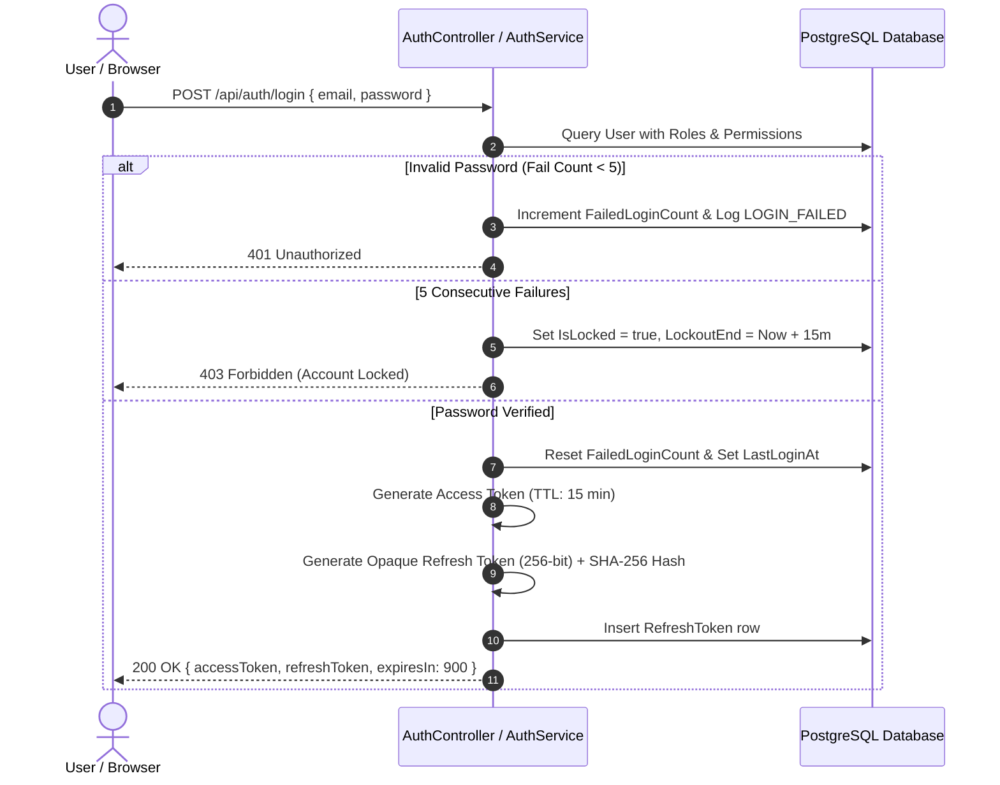
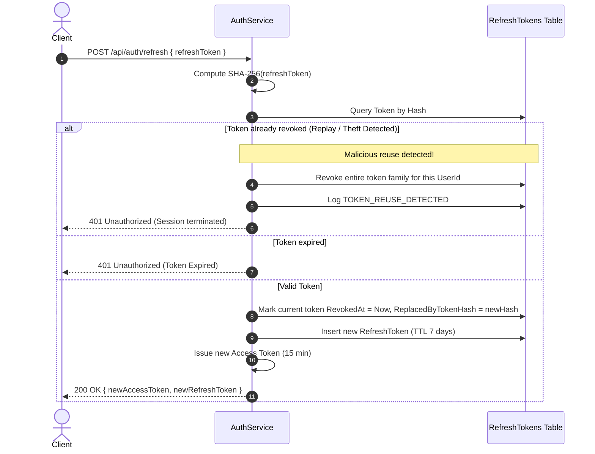
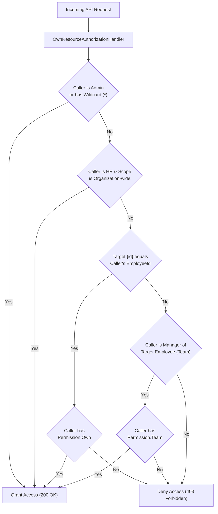

# EMS Security & Authorization Specification

## 1. Authentication & JWT Lifecycle

---

## 2. Refresh Token Rotation & Theft Detection

---

## 3. RBAC & Horizontal Access Control Matrix

### Security Highlights:
- **Password Hashing**: PBKDF2 HMAC-SHA256, 100,000 iterations, 128-bit cryptographically secure per-user salt.
- **Data Protection**: Sensitive payloads (passwords, tokens, raw cryptographic keys) are excluded from Serilog output and database audit logs.
- **SQL Injection Prevention**: Parameterized queries and EF Core LINQ projections eliminate injection risks.
- **Cross-Site Scripting (XSS)**: Handled via React standard text escaping and JSON response serialization.
